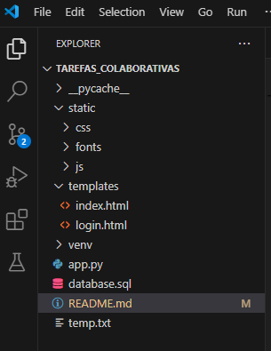

# Aplicação de Lista de Tarefas Colaborativa

A aplicação web de lista de tarefas  colaborativa, na qual os usuários podem criar, 
visualizar, atualizar e excluir tarefas, bem  como compartilhá-las com outros usuários. 
A aplicação permite a colaboração em  tempo real e sincronização entre os dispositivos dos usuários


### Dependências e ferramentas Utilizadas

* Sistema Operativo Windows 10
* Linguagem Python para backend 
* HTML, CSS e Javascript para frontend
* biblioteca flask (para as requisições http)
* biblioteca flask_mysqldb para as operações CRUD
* XAMP (para utilizar o Apache e o MySQL)

### Instalação e consiguração do ambiente  

* Criação e activação da variavers ambientes 
```
virtualenv env
.\venv\Scripts\activate.bat
```
* Instalação das BIbliotecas
```
pip install flask 
pip install flask_mysqldb
```

### Estrutura do projecto


### Executando o programa

* Como executar o programa
```
flask run
```


## Autor

Mucano da Cruz 


